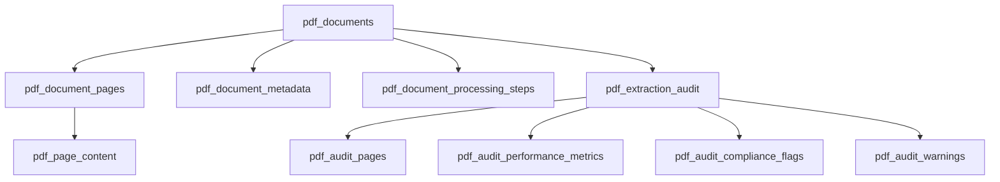

# Laravel PDF Viewer Package

A comprehensive, enterprise-grade Laravel package for processing massive PDF documents with advanced page-by-page processing, full-text search capabilities, and comprehensive audit trails. Designed specifically for handling large PDFs (9000+ pages) with robust serverless deployment support.

> **Latest**: Enhanced audit system, performance monitoring, and edge case handling added in v1.3.0!

## Features

### Core Processing Features
- 📄 **Page-by-page PDF processing** for massive documents (9000+ pages)
- 🔍 **Full-text search** with MySQL FULLTEXT indexes and relevance scoring
- ⚡ **Three-tier parallel processing** with intelligent queue management
- 🔒 **Hash-based security** to prevent document ID enumeration
- 📊 **Comprehensive audit trails** with legal compliance support (GDPR, HIPAA, SOX)
- ⚖️ **Performance monitoring** with built-in metrics collection
- 🔧 **Pure PHP fallbacks** - No external dependencies required

### Enterprise Features
- 🛡️ **Edge case detection** - Handles encrypted PDFs, portfolios, and complex structures
- 📈 **Resource optimization** with intelligent font and resource handling
- 🔄 **Cross-reference management** for complex PDF internal references
- 🎯 **Fallback mechanisms** with multiple extraction strategies
- 📝 **Smart text extraction** with page-aware parsing and UTF-8 validation
- 🚨 **Health monitoring** and system diagnostics

### Infrastructure & Integration
- ☁️ **Laravel Vapor compatible** with S3 storage and serverless deployment
- 🏗️ **Flexible storage** supporting local, S3, and other Laravel filesystem drivers
- 🚀 **Multi-layer caching** with Redis support and tag-based invalidation
- 📦 **Multipart upload support** for large files with resumable uploads
- 🔗 **Mozilla PDF.js integration** ready
- 🧪 **Complete test coverage** with comprehensive unit and feature tests
- 🎯 **SOLID design principles** with interface-based architecture

## Requirements

- PHP 8.2+
- Laravel 11.0+ or 12.0+
- MySQL 5.7+ (with FULLTEXT search support) or PostgreSQL 10+ or SQLite 3.25+
- Redis (recommended for caching and queues)
- Queue driver (Redis/Database recommended for production)

### System Dependencies (Optional)
- **pdftk** (preferred for PDF splitting and page extraction)
- **ImageMagick** or **GD** (for thumbnail generation)

**Note**: The package includes pure PHP fallbacks for all system dependencies, so external tools are optional but recommended for better performance.

### Enterprise Requirements (Optional)
- **Legal compliance modules**: Additional audit trail storage for GDPR/HIPAA/SOX compliance
- **Performance monitoring**: Advanced metrics collection and analysis tools
- **Redis Cluster**: For high-availability caching in enterprise environments

### For S3/Laravel Vapor Support

- AWS SDK for PHP 3.0+ (automatically installed)
- League Flysystem S3 adapter 3.0+ (automatically installed)
- Valid AWS S3 bucket and credentials

## Installation

1. **Install via Composer:**
```bash
composer require shakewellagency/laravel-pdf-viewer
```

2. **Publish and run migrations:**
```bash
php artisan vendor:publish --provider="Shakewellagency\\LaravelPdfViewer\\Providers\\PdfViewerServiceProvider" --tag="migrations"
php artisan migrate
```

3. **Publish configuration file:**
```bash
php artisan vendor:publish --provider="Shakewellagency\\LaravelPdfViewer\\Providers\\PdfViewerServiceProvider" --tag="config"
```

4. **Configure environment variables:**

**For Local Storage:**
```env
# Storage Configuration
PDF_VIEWER_STORAGE_DISK=local
PDF_VIEWER_STORAGE_PATH=pdf-documents
```

**For AWS S3/Laravel Vapor:**
```env
# Storage Configuration
PDF_VIEWER_STORAGE_DISK=s3

# AWS S3 Configuration (Package-specific to avoid conflicts)
PDF_VIEWER_AWS_ACCESS_KEY_ID=your_access_key_here
PDF_VIEWER_AWS_SECRET_ACCESS_KEY=your_secret_access_key_here
PDF_VIEWER_AWS_REGION=ap-southeast-2
PDF_VIEWER_AWS_BUCKET=your-bucket-name
PDF_VIEWER_AWS_USE_PATH_STYLE_ENDPOINT=false
```

**Common Processing Configuration:**
```env
# Processing Configuration
PDF_VIEWER_MAX_FILE_SIZE=104857600
PDF_VIEWER_PROCESSING_TIMEOUT=1800
PDF_VIEWER_PARALLEL_JOBS=10

# Job Configuration
PDF_VIEWER_JOB_QUEUE=default
PDF_VIEWER_JOB_CONNECTION=redis
PDF_VIEWER_JOB_RETRY_ATTEMPTS=3

# Cache Configuration
PDF_VIEWER_CACHE_ENABLED=true
PDF_VIEWER_CACHE_TTL=3600
PDF_VIEWER_CACHE_PREFIX=pdf_viewer

# Search Configuration
PDF_VIEWER_SEARCH_MIN_SCORE=0.1
PDF_VIEWER_SEARCH_SNIPPET_LENGTH=200

# Thumbnail Configuration
PDF_VIEWER_THUMBNAILS_ENABLED=true
PDF_VIEWER_THUMBNAILS_WIDTH=300
PDF_VIEWER_THUMBNAILS_HEIGHT=400
PDF_VIEWER_THUMBNAILS_QUALITY=80
```

## Architecture Overview

### System Design

The Laravel PDF Viewer package implements a sophisticated, enterprise-grade architecture designed for processing massive PDF documents with maximum efficiency and reliability.

#### Core Architecture Patterns
- **Service Layer Architecture**: Clear separation between controllers, services, and models
- **Repository Pattern**: Interface-based data access with dependency injection
- **Strategy Pattern**: Multiple extraction strategies with intelligent fallback mechanisms
- **Observer Pattern**: Model events for automatic hash generation and comprehensive audit trails
- **Command Pattern**: Queue-based job processing with intelligent retry logic and circuit breakers

#### Database Architecture



#### Key Components

**Core Models**
- **PdfDocument**: Main document entity with hash-based identification and soft deletes
- **PdfDocumentPage**: Individual page records with processing status and metadata
- **PdfPageContent**: Separated content storage optimized for FULLTEXT search
- **PdfDocumentMetadata**: Normalized metadata with intelligent type casting
- **PdfExtractionAudit**: Comprehensive audit trail for legal compliance

**Processing Services**
- **DocumentService**: Document lifecycle management and multipart upload coordination
- **PageProcessingService**: Advanced PDF page extraction with resource optimization
- **SearchService**: Full-text search with caching and relevance scoring
- **ExtractionAuditService**: Legal compliance audit trail management
- **EdgeCaseDetectionService**: Sophisticated PDF structure analysis and handling

**Infrastructure Services**
- **CacheService**: Multi-layer caching with tag-based invalidation and Redis support
- **CrossReferenceService**: PDF internal reference and resource management
- **PerformanceOptimizationService**: Resource monitoring and optimization
- **MonitoringService**: System health monitoring and diagnostics

### Processing Workflow

The package implements a sophisticated three-tier processing architecture:

1. **Document Analysis Phase**
   - PDF structure analysis and edge case detection
   - Resource inventory and optimization planning
   - Processing strategy selection based on document characteristics

2. **Parallel Page Processing**
   - Individual page extraction with resource preservation
   - Text extraction using multiple strategies with fallback mechanisms
   - Thumbnail generation and quality optimization
   - Real-time audit trail generation

3. **Search Index Population**
   - Intelligent text cleaning and UTF-8 validation
   - FULLTEXT index population with relevance scoring
   - Cross-reference mapping and internal link preservation
   - Cache warming and performance optimization

## Recent Improvements

### Enhanced Text Extraction (v1.2.0)

The package now features a robust text extraction system with multiple fallback strategies:

#### Primary Text Extraction
- Uses **smalot/pdfparser** for pure PHP text extraction
- Page-aware parsing that extracts text from specific pages
- Direct extraction from original PDF files (no temporary files required)
- Full UTF-8 support with proper encoding validation

#### Intelligent Fallback System
1. **PDF Page Extraction**: Uses `pdftk` when available for page splitting
2. **Pure PHP Fallback**: When `pdftk` is unavailable, creates reference files and extracts directly
3. **Smart Reference System**: Maintains page mapping for accurate text extraction
4. **Error Recovery**: Continues processing even when individual pages fail

#### Search Integration
- Automatic indexing of extracted text content
- Full-text search with MySQL FULLTEXT indexes
- Search snippets with highlighted terms
- Relevance scoring for better search results

```php
// Text extraction happens automatically during processing
$document = $documentService->upload($uploadedFile);

// Search becomes available once processing is complete
$results = $searchService->searchDocuments('important safety procedures');

foreach ($results as $document) {
    echo "Relevance: {$document->relevance_score}\n";
    foreach ($document->search_snippets as $snippet) {
        echo "Page {$snippet['page_number']}: {$snippet['snippet']}\n";
    }
}
```

## Usage

### Document Upload

```php
use Shakewellagency\LaravelPdfViewer\Services\DocumentService;

$documentService = app(DocumentService::class);

$uploadedFile = request()->file('pdf');
$metadata = [
    'title' => 'Aviation Safety Manual',
    'description' => 'Comprehensive safety procedures',
    'metadata' => [
        'author' => 'Aviation Authority',
        'subject' => 'Safety Procedures',
    ],
];

$document = $documentService->upload($uploadedFile, $metadata);
```

### Multipart Upload (S3/Large Files)

For large PDF files (especially when using S3), you can use multipart uploads with signed URLs for better performance and reliability:

```php
use Shakewellagency\LaravelPdfViewer\Services\DocumentService;

$documentService = app(DocumentService::class);

// 1. Initiate multipart upload
$metadata = [
    'title' => 'Large Aviation Manual',
    'original_filename' => 'large-aviation-manual.pdf',
    'file_size' => 52428800, // 50MB
    'total_parts' => 10
];

$uploadData = $documentService->initiateMultipartUpload($metadata);
$documentHash = $uploadData['document_hash'];
$uploadId = $uploadData['upload_id'];

// 2. Get signed URLs for each part (client-side upload)
$urlsData = $documentService->getMultipartUploadUrls($documentHash, 10);
$signedUrls = $urlsData['urls'];

// Client uploads parts directly to S3 using the signed URLs
// Each part returns an ETag that needs to be collected

// 3. Complete the multipart upload
$parts = [
    ['PartNumber' => 1, 'ETag' => '"d41d8cd98f00b204e9800998ecf8427e"'],
    ['PartNumber' => 2, 'ETag' => '"098f6bcd4621d373cade4e832627b4f6"'],
    // ... more parts
];

$result = $documentService->completeMultipartUpload($documentHash, $parts);

// 4. Or abort the upload if needed
// $documentService->abortMultipartUpload($documentHash);
```

### Laravel Vapor Deployment

The package is fully compatible with Laravel Vapor serverless deployment:

1. **Automatic S3 Integration**: When `PDF_VIEWER_STORAGE_DISK=s3` is configured, the package automatically uses S3 for file storage.

2. **Lambda Timeout Handling**: Processing is designed to work within Lambda's 15-minute timeout limit by using efficient page-by-page processing.

3. **Temporary File Management**: All processing uses `/tmp` directory which is available in Lambda environments.

4. **Package-Specific AWS Credentials**: Uses `PDF_VIEWER_AWS_*` environment variables to avoid conflicts with other packages or Vapor's own AWS configuration.

### Document Search

```php
use Shakewellagency\LaravelPdfViewer\Services\SearchService;

$searchService = app(SearchService::class);

// Search documents
$documents = $searchService->searchDocuments('aviation safety', [
    'status' => 'completed',
    'date_from' => now()->subDays(30),
]);

// Search pages
$pages = $searchService->searchPages('emergency procedures');

// Get search suggestions
$suggestions = $searchService->getSearchSuggestions('aviat');
```

### Caching

```php
use Shakewellagency\LaravelPdfViewer\Services\CacheService;

$cacheService = app(CacheService::class);

// Warm cache for a document
$cacheService->warmDocumentCache($documentHash);

// Get cached page content
$pageContent = $cacheService->getCachedPageContent($documentHash, $pageNumber);

// Invalidate document cache
$cacheService->invalidateDocumentCache($documentHash);
```

## API Endpoints

### Document Management

| Method | Endpoint | Description |
|--------|----------|-------------|
| `POST` | `/api/pdf-viewer/documents` | Upload PDF document |
| `GET` | `/api/pdf-viewer/documents` | List documents |
| `GET` | `/api/pdf-viewer/documents/{hash}` | Get document metadata |
| `PUT` | `/api/pdf-viewer/documents/{hash}` | Update document metadata |
| `DELETE` | `/api/pdf-viewer/documents/{hash}` | Delete document |
| `GET` | `/api/pdf-viewer/documents/{hash}/progress` | Get processing progress |
| `POST` | `/api/pdf-viewer/documents/{hash}/process` | Manually trigger processing |
| `POST` | `/api/pdf-viewer/documents/{hash}/retry` | Retry failed processing |
| `POST` | `/api/pdf-viewer/documents/{hash}/cancel` | Cancel ongoing processing |

### Multipart Upload (S3)

| Method | Endpoint | Description |
|--------|----------|-------------|
| `POST` | `/api/pdf-viewer/documents/multipart/initiate` | Initiate multipart upload |
| `POST` | `/api/pdf-viewer/documents/{hash}/multipart/urls` | Get signed upload URLs |
| `POST` | `/api/pdf-viewer/documents/{hash}/multipart/complete` | Complete multipart upload |
| `DELETE` | `/api/pdf-viewer/documents/{hash}/multipart/abort` | Abort multipart upload |

### Page Management

| Method | Endpoint | Description |
|--------|----------|-------------|
| `GET` | `/api/pdf-viewer/documents/{hash}/pages` | List document pages |
| `GET` | `/api/pdf-viewer/documents/{hash}/pages/{page}` | Get specific page |
| `GET` | `/api/pdf-viewer/documents/{hash}/pages/{page}/thumbnail` | Get page thumbnail |
| `GET` | `/api/pdf-viewer/documents/{hash}/pages/{page}/download` | Download specific page as PDF |

### Search

| Method | Endpoint | Description |
|--------|----------|-------------|
| `GET` | `/api/pdf-viewer/search/documents` | Search across all documents |
| `GET` | `/api/pdf-viewer/search/documents/{hash}` | Search within specific document |
| `GET` | `/api/pdf-viewer/search/pages` | Search pages with snippets |
| `GET` | `/api/pdf-viewer/search/suggestions` | Get search suggestions |

### Utilities

| Method | Endpoint | Description |
|--------|----------|-------------|
| `POST` | `/api/pdf-viewer/utils/cache/clear` | Clear all cached data |
| `POST` | `/api/pdf-viewer/utils/cache/warm/{hash}` | Pre-generate cache for document |
| `GET` | `/api/pdf-viewer/utils/stats` | Get system statistics |
| `GET` | `/api/pdf-viewer/utils/health` | System health check |

## Job Processing Architecture

The package uses a 3-stage job processing system for maximum parallelization:

### 1. ProcessDocumentJob
- Orchestrates the entire processing pipeline
- Splits PDF into individual pages
- Dispatches ProcessPageTextJob for each page
- Handles processing completion and error states

### 2. ExtractPageJob
- Extracts individual pages from PDF using pdftk (with pure PHP fallback)
- Creates individual page files for text extraction
- Generates high-quality thumbnails using ImageMagick or GD
- Dispatches ProcessPageTextJob for text processing

### 3. ProcessPageTextJob
- Extracts text content using smalot/pdfparser (pure PHP solution)
- Implements page-aware text extraction directly from original PDF
- Processes and cleans extracted text with UTF-8 validation
- Indexes content for full-text search
- Updates final page completion status

### Queue Configuration

Jobs can be distributed across different queues for optimal performance:

```env
# Primary document processing queue
PDF_VIEWER_JOB_QUEUE=pdf-processing

# Page-specific processing queues
PDF_VIEWER_PAGE_QUEUE=pdf-pages
PDF_VIEWER_TEXT_QUEUE=pdf-text

# Queue connections
PDF_VIEWER_JOB_CONNECTION=redis
```

### Error Handling & Retries

- **Automatic Retries**: Jobs automatically retry up to 3 times with exponential backoff
- **Dead Letter Queue**: Failed jobs are logged for manual inspection
- **Progressive Fallbacks**: Graceful degradation when external tools fail (pdftk → pure PHP fallback)
- **Smart Text Extraction**: Direct extraction from original PDFs when page files are unavailable
- **Status Tracking**: Real-time processing status updates
- **Comprehensive Logging**: Detailed error logging with context for debugging

## Testing

The package includes a comprehensive test suite covering all functionality:

### Test Coverage
- **Unit Tests**: Core service functionality with 25+ test methods per service
  - PageProcessingService: Text extraction, page validation, UTF-8 handling
  - SearchService: Full-text search, snippets, indexing, caching
  - Job Classes: ProcessDocumentJob, ExtractPageJob, ProcessPageTextJob
- **Feature Tests**: Complete API endpoint testing
- **Integration Tests**: Database interactions and job processing
- **Performance Tests**: Large document handling capabilities

### Test Features
- **Mock Services**: Comprehensive mocking of external dependencies
- **Database Testing**: RefreshDatabase trait for isolated test runs
- **File System Testing**: Storage::fake() for file operation testing
- **Job Testing**: Bus::fake() for queue job verification
- **Logging Testing**: Log::spy() for logging verification
- **Error Scenarios**: Exception handling and failure recovery testing

```bash
# Run all tests
vendor/bin/phpunit

# Run with coverage
vendor/bin/phpunit --coverage-html coverage

# Run specific test suites
vendor/bin/phpunit tests/Unit/Services/
vendor/bin/phpunit tests/Unit/Jobs/
```

### Test Structure
```
tests/
├── Unit/
│   ├── Services/
│   │   ├── PageProcessingServiceTest.php (20+ methods)
│   │   └── SearchServiceTest.php (25+ methods)
│   └── Jobs/
│       ├── ProcessDocumentJobTest.php (15+ methods)
│       ├── ExtractPageJobTest.php (15+ methods)
│       └── ProcessPageTextJobTest.php (15+ methods)
└── Feature/
    └── [API endpoint tests]
```

## Performance Considerations

### Large Document Handling

The package is specifically designed for massive PDF documents:

- **Memory Efficient**: Pages processed individually, never loading entire document
- **Parallel Processing**: Multiple pages processed simultaneously
- **Progress Tracking**: Real-time progress updates for long-running operations
- **Fault Tolerance**: Individual page failures don't affect entire document

### Optimization Strategies

- **Database Indexing**: Optimized indexes for hash lookups and search queries
- **Caching Strategy**: Multi-layer caching for thumbnails and processed content
- **Queue Management**: Separate queues for different processing stages
- **Resource Limiting**: Configurable parallel job limits to prevent resource exhaustion

## Security & Compliance Features

### Security Architecture
- **Hash-Based Document Access**: Documents identified by cryptographic hashes instead of sequential IDs
- **Enumeration Attack Prevention**: No predictable document identifiers exposed
- **Secure URL Generation**: Cryptographically signed URLs for thumbnails and downloads
- **Input Sanitization**: Comprehensive validation and sanitization of all user inputs
- **File Type Validation**: Strict PDF-only upload validation with MIME type verification
- **Size Limit Enforcement**: Configurable file size limits with graceful error handling

### Enterprise Security Features
- **Malicious Content Detection**: Advanced PDF structure analysis for potential threats
- **Resource Exhaustion Protection**: Intelligent processing limits and timeout management
- **Audit Trail Integrity**: Cryptographic verification of audit log modifications
- **Access Pattern Monitoring**: Suspicious access pattern detection and alerting
- **Data Loss Prevention**: Automated backup verification and recovery testing

### Legal Compliance Support

#### GDPR Compliance
- **Data Minimization**: Only necessary data is collected and stored
- **Right to Erasure**: Complete document and audit trail deletion capabilities
- **Data Portability**: Export functionality for all user data
- **Audit Trail**: Comprehensive logging of all data processing activities
- **Consent Management**: Integration points for consent tracking systems

#### HIPAA Compliance  
- **Access Logging**: Complete audit trail of all document access and modifications
- **Data Encryption**: Encryption at rest and in transit for all sensitive content
- **Minimum Necessary Standard**: Role-based access control integration points
- **Business Associate Support**: Configurable audit retention and reporting
- **Breach Notification**: Automated breach detection and notification workflows

#### SOX Compliance
- **Document Integrity**: Cryptographic verification of document completeness
- **Change Control**: Immutable audit trail for all document processing changes
- **Access Controls**: Role-based permission system with separation of duties
- **Retention Policies**: Configurable 7-year retention with automated archival
- **Financial Controls**: Integration points for financial document classification

### Audit Trail System

The package includes a comprehensive audit system designed for legal compliance:

```php
// Complete audit trail for every operation
$audit = PdfExtractionAudit::create([
    'document_hash' => $documentHash,
    'extraction_method' => 'smalot_pdfparser',
    'processing_time_ms' => 1250,
    'success_rate' => 98.5,
    'compliance_flags' => 'GDPR,HIPAA,SOX',
    'data_integrity_hash' => $integrityHash,
    'user_id' => auth()->id(),
    'ip_address' => request()->ip(),
    'user_agent' => request()->userAgent(),
]);

// Performance metrics for compliance reporting
$performanceMetric = PdfAuditPerformanceMetric::create([
    'audit_id' => $audit->id,
    'metric_type' => 'processing_time',
    'metric_value' => 1.25,
    'threshold_value' => 5.0,
    'compliance_status' => 'within_limits',
]);

// Automated compliance verification
$complianceFlag = PdfAuditComplianceFlag::create([
    'audit_id' => $audit->id,
    'regulation_type' => 'GDPR',
    'requirement' => 'data_minimization',
    'compliance_status' => 'compliant',
    'verification_method' => 'automated_scan',
]);
```

### Data Protection Measures
- **Encryption at Rest**: AES-256 encryption for all stored documents
- **Encryption in Transit**: TLS 1.3 for all data transmission
- **Key Management**: Secure key rotation and management protocols
- **Access Logging**: Complete audit trail of all access attempts
- **Data Retention**: Automated retention policy enforcement with secure deletion

## Contributing

We welcome contributions! Please see [CONTRIBUTING.md](CONTRIBUTING.md) for guidelines.

### Development Setup

1. Clone the repository
2. Install dependencies: `composer install`
3. Copy and configure: `cp .env.example .env`
4. Run migrations: `php artisan migrate`
5. Run tests: `composer test`

## Changelog

Please see [CHANGELOG.md](CHANGELOG.md) for version history and notable changes.

## License

This package is licensed under the MIT License. See [LICENSE](LICENSE) file for details.

## Support

- **Documentation**: Complete API documentation available in `/docs`
- **Examples**: Sample implementations in `/examples`
- **Issues**: Report bugs via GitHub Issues
- **Discussions**: Community support via GitHub Discussions

---

Built with ❤️ for handling massive PDF documents efficiently.